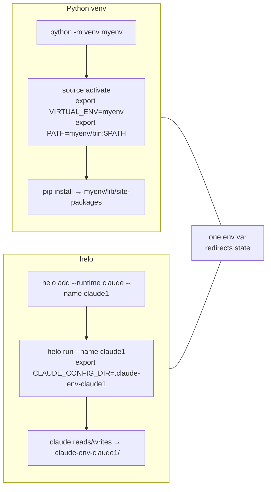
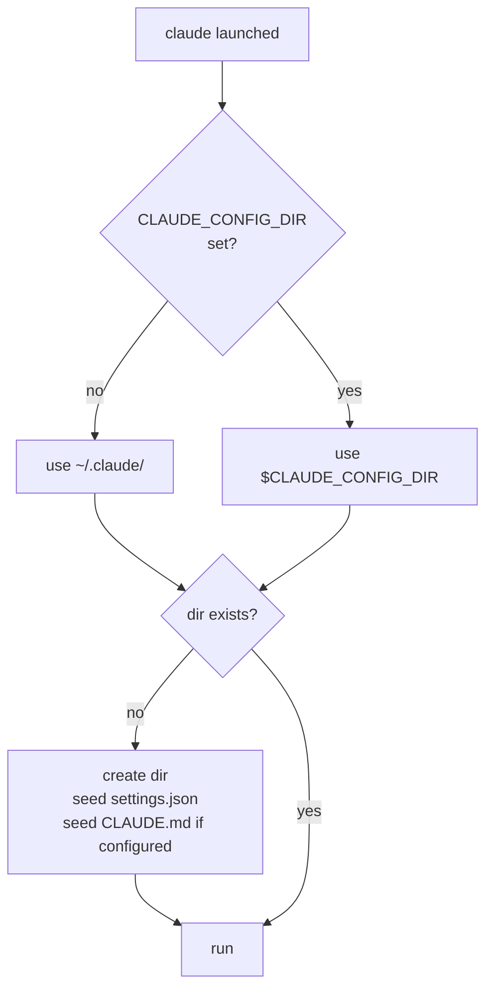
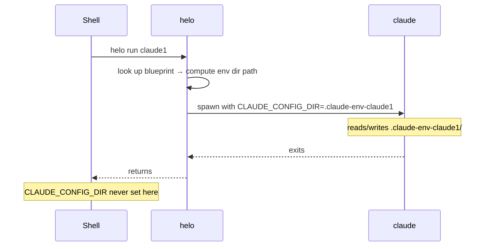
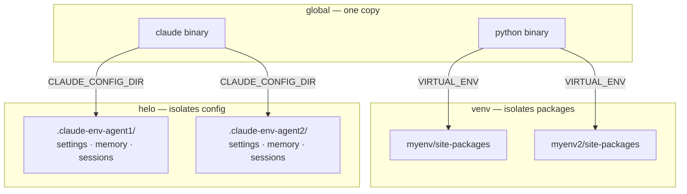
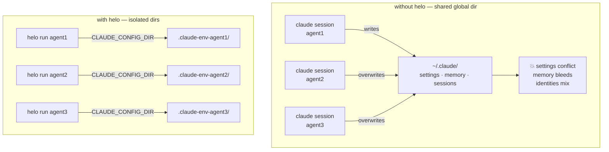

# Concepts

## The core idea

helo is to AI runtimes what Python venv is to Python packages — isolated environments per project, per agent.

The mechanism is a single env var that each runtime checks at startup. If set, the runtime reads and writes its config to that path instead of the global default.



## How Claude resolves its config dir

`CLAUDE_CONFIG_DIR` is not set by Claude — it's an input contract. Claude checks for it at startup and uses whatever it finds. No helo required; you could set it manually.



If not set: falls back to `~/.claude/` — not an error. That's the problem without helo: every claude invocation on your machine shares that one directory.

## The env var as a contract

`CLAUDE_CONFIG_DIR` has nothing to do with your system. It's just an agreement between you and the claude binary: "if you see this var, use that path."

Same pattern everywhere in Unix:

```bash
EDITOR=vim git commit           # tell git which editor to open
DEBUG=1 node app.js             # tell node to enable debug output
CLAUDE_CONFIG_DIR=... claude    # tell claude where its config lives
```

The program doesn't own the variable. It only reads it. You provide it. helo automates the providing.

## Env var lifetime

`CLAUDE_CONFIG_DIR` is injected per-process. It does not persist in your shell, registry, or anywhere on disk. It lives only for the duration of the claude subprocess helo spawns.



The **persistence** is the env dir on disk — `.claude-env-claude1/` stays between runs. The var is re-injected fresh each time.

## Binary vs config isolation

helo isolates config, not the binary. The runtime binary stays global — shared across all envs.



Upgrade `claude` once — all envs get the new version. Each env keeps its own independent state.

## The problem without helo



## Without helo

You could do this manually in three lines:

```bash
mkdir -p .claude-env-claude1
CLAUDE_CONFIG_DIR=$(pwd)/.claude-env-claude1 claude
```

helo's value is making that ergonomic at scale: named blueprints, multiple projects, state persisted across reboots, reproducible across machines via a committed `.helo.toml`.

## Key terms

**Blueprint** — a named AI identity stored globally in `config.toml`. Fields: name, runtime, provider, model, optional API key, optional CLAUDE.md template. Shared across projects.

**Instance** — a blueprint placed into a specific project directory. Stored as `.helo.toml` inside the env dir. Tracks which blueprint it came from.

**Env dir** — the isolated directory for one agent in one project. Named `.claude-env-<name>/`, `.pi-env-<name>/`, `.opencode-env-<name>/`. Contains all config and state for that agent.
