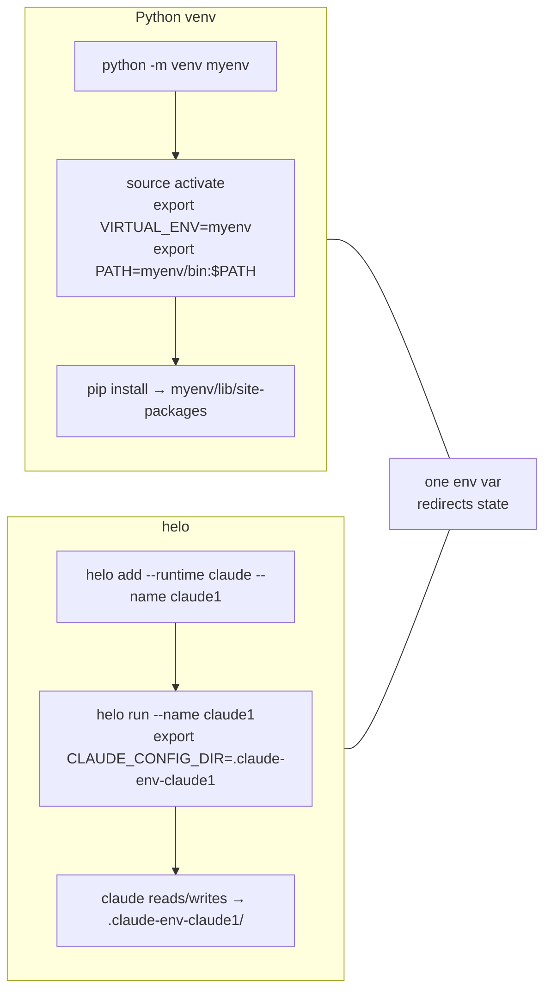
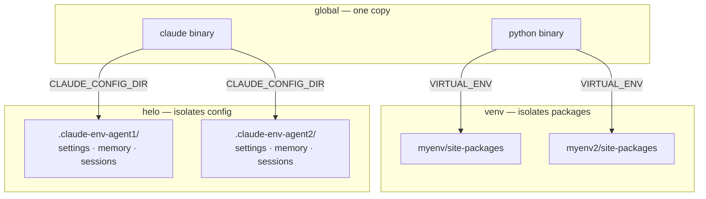

# Concepts

## The core idea

helo is to AI runtimes what Python venv is to Python packages — isolated environments per project, per agent.

The mechanism is a single env var that each runtime checks at startup. If set, the runtime reads and writes its config to that path instead of the global default.



## How isolation works

Each AI runtime has one env var that redirects its config directory:

| Runtime | Env var | Default (no helo) |
|---------|---------|-------------------|
| claude | `CLAUDE_CONFIG_DIR` | `~/.claude/` |
| pi | `PI_CODING_AGENT_DIR` | `~/.pi/` |
| opencode | `OPENCODE_CONFIG` | `~/.opencode/` |

`helo run` sets that var to the project-local env dir, then launches the binary:

```bash
# what helo run does under the hood
export CLAUDE_CONFIG_DIR=/your/project/.claude-env-claude1
claude
```

Settings, sessions, memory, CLAUDE.md — everything Claude reads and writes goes into `.claude-env-claude1/`. The global `~/.claude/` is never touched.

## Binary vs config isolation

helo isolates config, not the binary. The runtime binary stays global — shared across all envs.



Upgrade `claude` once — all envs get the new version. Each env keeps its own independent state.

## Without helo

You could do this manually in three lines:

```bash
mkdir -p .claude-env-claude1
CLAUDE_CONFIG_DIR=$(pwd)/.claude-env-claude1 claude
```

helo's value is making that ergonomic at scale: named blueprints, multiple projects, state persisted across reboots, reproducible across machines via a committed `.helo.toml`.

## Key terms

**Blueprint** — a named AI identity stored globally in `config.toml`. Fields: name, runtime, provider, model, optional API key, optional CLAUDE.md template. Shared across projects.

**Instance** — a blueprint placed into a specific project directory. Stored as `.helo.toml` inside the env dir. Tracks which blueprint it came from.

**Env dir** — the isolated directory for one agent in one project. Named `.claude-env-<name>/`, `.pi-env-<name>/`, `.opencode-env-<name>/`. Contains all config and state for that agent.
