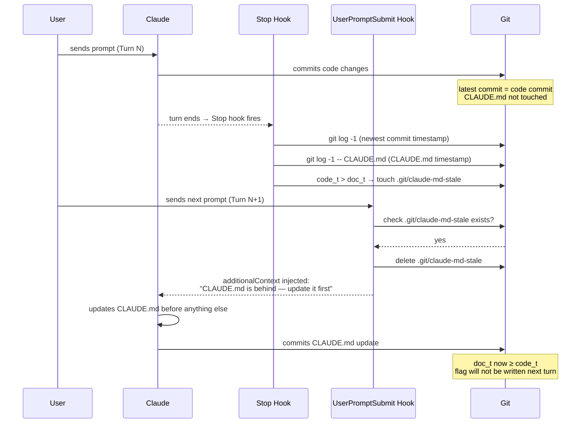

# Hooks

helo seeds a two-hook pattern into new Claude environment `settings.json` to keep CLAUDE.md in sync with code changes.

## Pipeline



## Why hooks?

When an agent modifies code, CLAUDE.md (project instructions) can fall behind. Without hooks, Claude doesn't know the docs are stale.

## How it works

### Stop hook

Runs at the end of every Claude turn. Compares the most recent commit timestamp against CLAUDE.md's last commit timestamp.

```bash
code_t=$(git log -1 --format="%ct" 2>/dev/null)
doc_t=$(git log -1 --format="%ct" -- CLAUDE.md 2>/dev/null)
[ -n "$code_t" ] && [ "${code_t:-0}" -gt "${doc_t:-0}" ] && touch .git/claude-md-stale || true
```

If code commits are newer than CLAUDE.md commits, it writes `.git/claude-md-stale` as a flag.

### UserPromptSubmit hook

Runs at the start of the next turn. If the flag file exists:
1. Deletes `.git/claude-md-stale`
2. Injects `additionalContext` into Claude's context

```
"CLAUDE.md is behind code commits — update it before doing anything else this turn."
```

This makes Claude **act on it** (unlike `systemMessage` which is user-facing only).

## Where hooks live

Hooks are written to the env dir's `settings.json` at instance creation time by `save_instance` (see `src/project.rs`). The commands themselves are generated in Rust, not stored in a standalone config file.

## Scope

The Stop hook has no path filter — any commit newer than the last commit that touched CLAUDE.md trips the stale flag. In practice this means: if you commit code and don't also update CLAUDE.md in the same (or a later) commit, the next turn will be reminded to update it.

## Disabling

Edit the env dir's `settings.json` and remove the `hooks` block.
