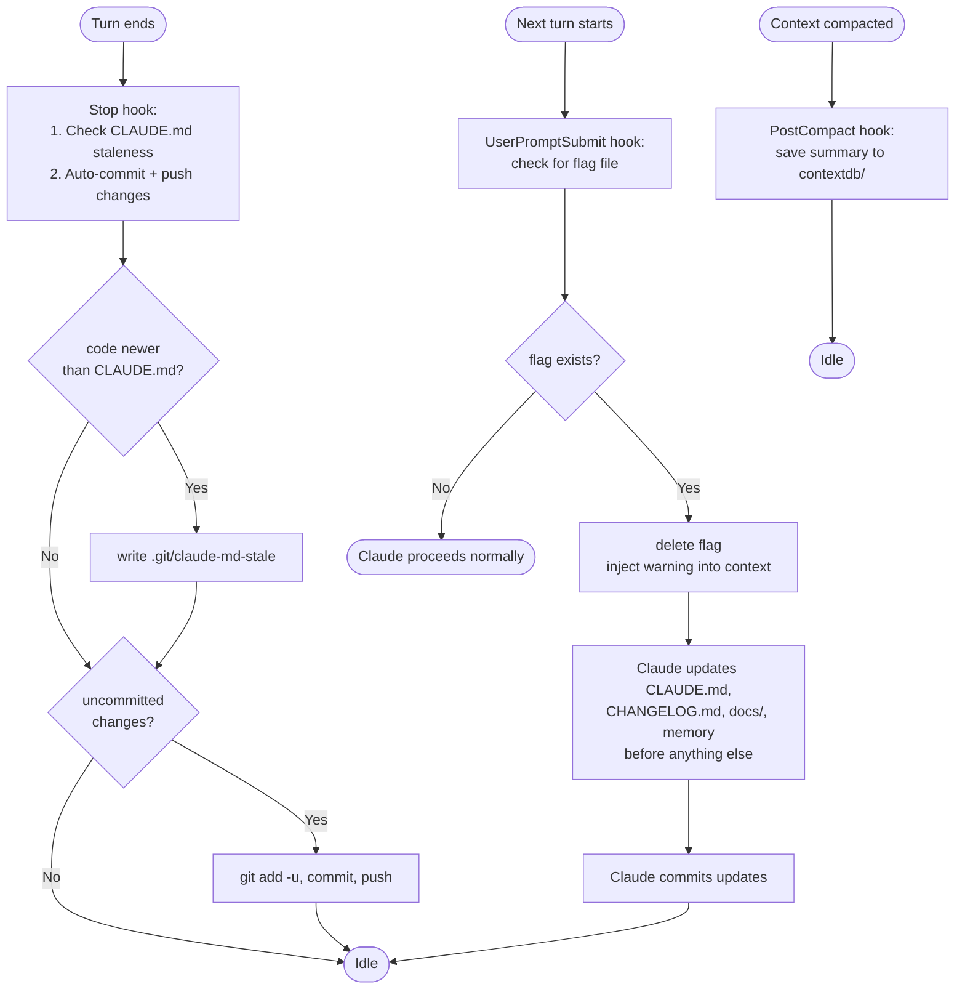

# Hooks

helo seeds hooks into new Claude environment `settings.json` to automate git operations and keep documentation in sync.

## Pipeline



## Why hooks?

When an agent modifies code, project documentation (CLAUDE.md, CHANGELOG.md, docs/, memory files) can fall behind. Hooks automate staleness detection and git syncing so nothing gets out of date.

## Hook events

### Stop hook

Runs at the end of every Claude turn. Two operations:

**1. Staleness detection**

```bash
code_t=$(git log -1 --format="%ct" 2>/dev/null)
doc_t=$(git log -1 --format="%ct" -- CLAUDE.md 2>/dev/null)
[ -n "$code_t" ] && [ "${code_t:-0}" -gt "${doc_t:-0}" ] && touch .git/claude-md-stale || true
```

Compares the most recent commit timestamp against CLAUDE.md's last commit timestamp. If code is newer, writes `.git/claude-md-stale` as a flag.

**2. Auto-commit + push**

```bash
if [ -n "$(git status --porcelain 2>/dev/null)" ]; then
  git add -u && git commit -m "auto: $(date -u +%Y-%m-%dT%H:%M:%SZ)" && git push 2>/dev/null || true
fi
```

If there are uncommitted changes to tracked files, stages, commits, and pushes them. Uses `git add -u` (tracked files only) so new untracked files aren't accidentally committed. Push errors are silently ignored (no remote, offline, etc.).

### UserPromptSubmit hook

Runs at the start of every turn. If the staleness flag exists:
1. Deletes `.git/claude-md-stale`
2. Injects `additionalContext` into Claude's context with:
   - **Staleness reminder**: update CLAUDE.md, CHANGELOG.md, docs/, and memory files
   - **Sub-agent evaluation**: evaluate if parallel sub-agents would help; only delegate when truly independent tasks benefit from parallelism
   - **Plan mode enforcement**: complex tasks (3+ files, architectural decisions) must enter plan mode first
   - **Terse style rule**: follow CLAUDE.md coding style

The full context string is injected every turn (not just when stale) so the sub-agent and plan mode instructions benefit from recency — they appear at the end of Claude's context where attention is highest.

CLAUDE.md is the staleness proxy — if it's behind, everything is assumed stale.

### PostCompact hook

Runs after every context compaction (both manual `/compact` and auto-compact). Saves a structured summary to `$CLAUDE_CONFIG_DIR/contextdb/<timestamp>_<session>.jsonl`.

Each entry contains:
```json
{
  "timestamp": "2026-04-19T12:00:00Z",
  "agent": "instance-name",
  "session": "abc12345",
  "trigger": "auto",
  "analysis": "<analysis section from compact summary>",
  "summary": "<summary section from compact summary>"
}
```

The agent name is extracted from the env dir name (e.g. `.claude-env-myagent` → `myagent`). The script lives at `$CLAUDE_CONFIG_DIR/hooks/post-compact.py`.

## Where hooks live

Hooks are written to the env dir's `settings.json` at instance creation time by `save_instance` (see `src/project.rs`). The shell commands are generated in Rust. The PostCompact Python script is embedded in the binary and written to the env dir.

## Scope

- **Staleness**: any commit newer than the last commit that touched CLAUDE.md trips the flag. The reminder covers CLAUDE.md, CHANGELOG.md, docs/, and memory files.
- **Auto-commit**: only tracked files (`git add -u`). New files stay untracked until explicitly added.
- **PostCompact**: fires for both manual and auto compaction. The `trigger` field distinguishes them.

## Disabling

Edit the env dir's `settings.json` and remove the `hooks` block.
